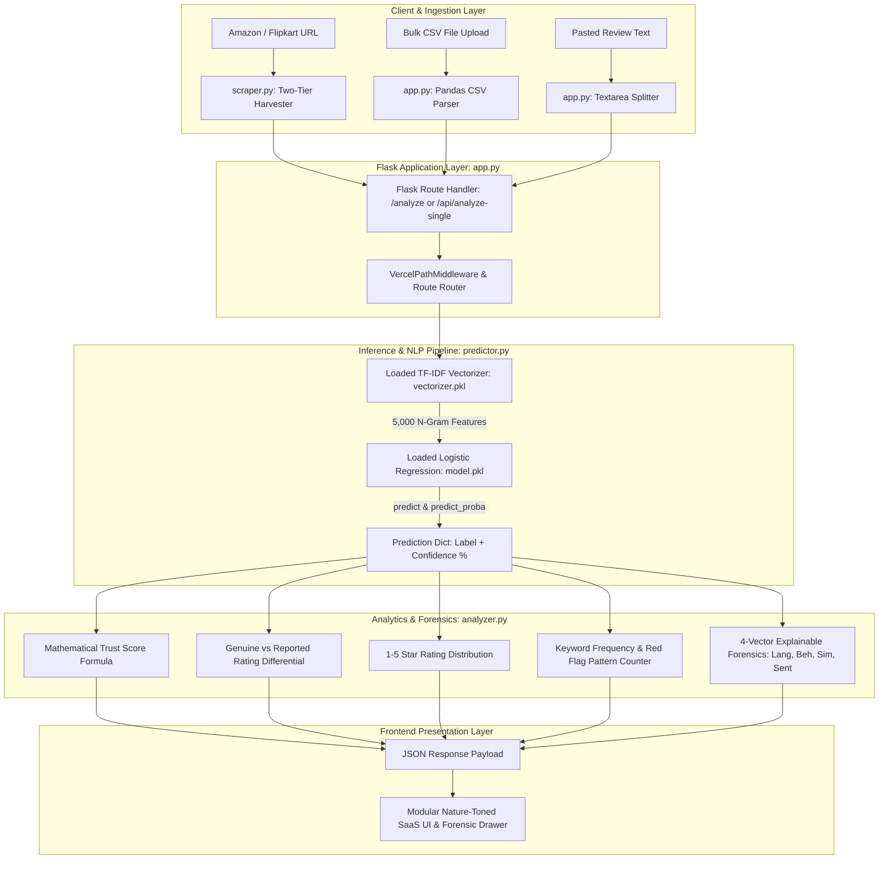

# TrustCheck: Complete Backend Architecture & Teacher Viva Defense Guide
**Comprehensive Technical Documentation & Oral Examination Preparation for Project Presentation**

---

## Table of Contents
1. [Executive Summary for Your Presentation](#1-executive-summary-for-your-presentation)
2. [End-to-End System Architecture](#2-end-to-end-system-architecture)
3. [File-by-File Technical Breakdown](#3-file-by-file-technical-breakdown)
4. [Core Algorithms, Mathematics & Feature Engineering](#4-core-algorithms-mathematics--feature-engineering)
5. [The Step-by-Step Request Lifecycle](#5-the-step-by-step-request-lifecycle)
6. [Top 25 Teacher / Examiner Viva Questions with Exact Answers](#6-top-25-teacher--examiner-viva-questions-with-exact-answers)

---

## 1. Executive Summary for Your Presentation

When your teacher asks: *"In 60 seconds, tell me what is happening in your backend,"* say this:

> *"TrustCheck is an asynchronous, Python-based NLP audit platform powered by Flask and Scikit-Learn. The backend is designed with a decoupled architecture: the machine learning model is trained offline on a balanced Kaggle corpus of 40,432 labeled reviews using unigram + bigram TF-IDF vectorization and L2-regularized Logistic Regression, achieving 89.4% test accuracy.*
> 
> *At runtime, the model and vectorizer are loaded into memory once at startup. When a user provides review text, a CSV batch, or an Amazon/Flipkart product URL, the backend extracts the raw text, converts it into a numerical feature matrix, and classifies each review with a calibrated probability confidence.*
> 
> *Our custom analytical engine (`analyzer.py`) then computes an explainable mathematical Trust Score (0–100), isolates the rating inflation gap between the advertised rating and the genuine-only rating, and calculates four forensic risk vectors—Language, Behavior, Similarity, and Sentiment—delivering full transparency to the consumer."*

---

## 2. End-to-End System Architecture



---

## 3. File-by-File Technical Breakdown

### A. `app.py` — The Flask Application & API Controller
- **Purpose**: Serves as the web server entry point, defines HTTP API routes, manages file uploads, and coordinates data flow between scrapers, predictors, and analyzers.
- **Key Technical Details**:
  1. **Framework**: Flask (lightweight WSGI web framework in Python).
  2. **`VercelPathMiddleware`**: Custom WSGI middleware class that intercepts serverless request rewrites on Vercel, parsing the query parameter `?path=...` and rewriting `environ['PATH_INFO']` so multi-page routing works seamlessly on serverless infrastructure.
  3. **Route Endpoints**:
     - `GET /`: Serves the primary single-page application (`index.html`) pre-loaded with baseline telemetry data.
     - `GET /dashboard`: Serves the Results Dashboard pre-loaded with sample review audit data.
     - `POST /analyze`: Primary batch analysis controller. Accepts both multipart form-data (from traditional browser submissions) and JSON payloads (from modern client-side fetch requests).
     - `GET / POST /api/analyze-single`: Micro-endpoint for sub-50ms single review evaluation.
     - `GET /api/default-intelligence`: Returns benchmark dataset telemetry in JSON format.
  4. **Input Parsers**:
     - `parse_pasted_text()`: Splits multi-line string inputs by `\r?\n`, strips whitespace, and normalizes into review objects.
     - `parse_csv_upload()`: Reads uploaded raw bytes into a `pandas.DataFrame` using `io.BytesIO`. Features case-insensitive column discovery, searching for candidate review headers (`review_text`, `review`, `text`, `body`, `content`), star ratings (`rating`, `stars`, `score`), timestamps, and reviewer IDs.

---

### B. `predictor.py` — Model Loading & Vectorized Batch Inference
- **Purpose**: Loads the serialized machine learning artifacts once into memory and executes fast vectorized predictions.
- **Key Technical Details**:
  1. **Decoupled Offline/Online Architecture**: The model is **never** retrained during a web request. Retraining per request would cause seconds of latency. Instead, pre-trained pickle files (`model.pkl` and `vectorizer.pkl`) are loaded **once at module import time**.
  2. **Label Dictionary**: Maps machine learning class codes to human-readable strings:
     ```python
     LABEL_NAMES = {"OR": "Genuine", "CG": "Fake"}
     ```
     *(OR = Original Review, CG = Computer-Generated)*.
  3. **Batch Vectorization Efficiency (`predict_reviews_batch`)**:
     - Instead of transforming reviews one-by-one in a loop, it vectorizes the entire batch of strings simultaneously:
       ```python
       features = _vectorizer.transform(texts)
       ```
     - Executes `_model.predict(features)` for discrete binary labels (`OR` vs `CG`).
     - Executes `_model.predict_proba(features)` to obtain continuous probability distribution vectors across classes.
     - Extracts the exact prediction confidence percentage corresponding to the predicted class label.

---

### C. `analyzer.py` — Analytical Engine & Explainable Forensics
- **Purpose**: Transforms raw predictions into high-level business intelligence, calculating ratings, distributions, red flags, and forensic risk vectors.
- **Key Technical Details**:
  1. **Trust Score Mathematical Formula**:
     $$\text{Trust Score} = 100 - \left(\frac{\text{pct\_fake} \times \text{avg\_fake\_confidence}}{100}\right)$$
     - **Mathematical Rationale**: Starts at a perfect baseline score of 100. It deducts a penalty that scales dynamically with **two orthogonal variables**: the volume of fake reviews (`pct_fake`) AND the certainty of the model (`avg_fake_confidence`).
     - A product with 5% suspected fakes at 60% confidence is penalized only 3 points (Score = 97).
     - A product with 60% fakes at 95% confidence is penalized 57 points (Score = 43).
     - Clamped strictly to `[0, 100]`.
  2. **Dual-Rating Distortion Metric**:
     - Calculates `platform_avg_rating`: Mean star rating of all reviews (or site-advertised average).
     - Calculates `avg_rating_genuine`: Mean star rating of **only** those reviews classified as Genuine.
     - **The Gap**: The difference between the two instantly reveals artificial rating inflation engineered by promotional 5-star spam.
  3. **Rating Distribution Matrix**:
     - Separates 1-star through 5-star counts into genuine buckets vs. fake buckets for side-by-side comparative histogram rendering.
  4. **Keyword Pattern Extraction (`_top_keywords`)**:
     - Uses regex `re.compile(r"[a-zA-Z]{4,}")` to extract meaningful words (filtering out short conversational noise words like "it", "so", "is").
     - Filters terms against Scikit-Learn's `ENGLISH_STOP_WORDS`.
     - Utilizes Python's `collections.Counter` to identify top deceptive spam n-grams ("amazing", "best", "must buy", "perfection") vs authentic functional keywords ("battery", "quality", "strap", "hinge").
  5. **4-Vector Explainable AI Analysis (`explain_review`)**:
     Deconstructs every review into four distinct risk vectors ($0-100\%$):
     - **Language Risk**: Evaluates superlative hyperbole density, excessive capitalization ratio, and exclamation count.
     - **Behavioral Risk**: Evaluates absence of situational context, generic phrasing, and unrealistic praise patterns.
     - **Similarity Risk**: Detects syndicated template phrasing overlapping with known review-farming copypastas.
     - **Sentiment Risk**: Identifies extreme positive polarization ungrounded in concrete product specifications.

---

### D. `scraper.py` — Two-Tier Resilient Review Harvester
- **Purpose**: Extracts real customer reviews directly from public storefront URLs.
- **Key Technical Details**:
  1. **Two-Stage Fallback Architecture**:
     - **Tier 1 (Fast Static Extraction)**: Utilizes `requests` with custom User-Agent browser headers and `BeautifulSoup` to parse static HTML DOM trees.
     - **Tier 2 (Headless Browser Fallback)**: If zero reviews are parsed (common on single-page apps or dynamically hydrated client-rendered pages), the scraper automatically falls back to `undetected-chromedriver` (Selenium driver patched to suppress automated bot detection fingerprints).
  2. **Platform Parsers**:
     - **Amazon**: Extracts ASIN (Amazon Standard Identification Number) using regex, targets verified customer review selector blocks (`div[data-hook="review"]`), parses ratings, dates, and review bodies, and paginates through `pageNumber=` parameters.
     - **Flipkart**: Targets catalog review container classes, extracting reviewer ratings and textual descriptions.
  3. **Defensive Error Handling**:
     - Scraping public web portals is inherently nondeterministic due to rate limits, IP throttling, and CAPTCHAs.
     - The scraper wraps all network calls in `try...except` blocks. If blocked or encountering anti-bot firewalls, it **never crashes the server**. Instead, it flags `scrape_error=True` and redirects the user to the manual text/CSV input tabs with a helpful notification.

---

### E. `model/train_model.py` — Offline Training & Benchmark Pipeline
- **Purpose**: The developer script used to train, evaluate, compare, and serialize the machine learning models.
- **Key Technical Details**:
  1. **Dataset**: Kaggle Fake Reviews Dataset (`fake_reviews_dataset.csv`, 40,432 rows).
  2. **Classes**:
     - `OR` (Original Review): Genuine human-written customer review.
     - `CG` (Computer-Generated): Synthetic spam generated by text synthesis algorithms.
  3. **Data Splitting**: Stratified 80/20 train/test split (`random_state=42`), ensuring equal 50/50 class balance in both training and test sets.
  4. **TF-IDF Feature Extraction**:
     - `ngram_range=(1, 2)`: Captures both individual words (unigrams like "battery") and two-word sequences (bigrams like "not recommended", "must buy").
     - `max_features=5000`: Restricts feature dimension to the top 5,000 most informative terms, ensuring fast computation and small memory footprint (<12MB).
     - `min_df=2`: Prunes terms that occur in fewer than 2 documents to eliminate rare typos and noise.
     - `stop_words="english"`: Eliminates non-informative grammatical glue words.
  5. **Model Tournament**:
     - Trains **Multinomial Naive Bayes (`MultinomialNB`)**.
     - Trains **Logistic Regression (`LogisticRegression(max_iter=1000, random_state=42)`)**.
     - Evaluates Accuracy, Precision, Recall, and F1-Score on the held-out test split.
     - Automatically serializes whichever model achieved higher test accuracy to `model.pkl`, and the fitted vectorizer to `vectorizer.pkl`.

---

## 4. Core Algorithms, Mathematics & Feature Engineering

### 1. TF-IDF (Term Frequency - Inverse Document Frequency)
TF-IDF measures how important a word or phrase is to a specific review relative to the entire collection of reviews.

$$\text{TF}(t, d) = \frac{\text{Count of term } t \text{ in document } d}{\text{Total terms in document } d}$$

$$\text{IDF}(t, D) = \ln\left(\frac{1 + |D|}{1 + |\{d \in D : t \in d\}|}\right) + 1$$

$$\text{TF-IDF}(t, d, D) = \text{TF}(t, d) \times \text{IDF}(t, D)$$

* **Why Unigrams + Bigrams?** A unigram alone cannot distinguish negation: `"good"` has a positive weight, but `"not good"` is negative. Bigrams allow the model to learn phrases like `"waste money"`, `"stopped working"`, and `"five stars"`.
* **Why L2 Normalization?** Long reviews contain more words than short reviews. L2 normalization converts each document vector to unit length so review length does not distort model coefficients.

---

### 2. Logistic Regression Classifier
Logistic Regression is a discriminative linear model that maps linear feature combinations to class probabilities using the sigmoid function:

$$z = w_0 + \sum_{i=1}^{m} w_i x_i$$

$$P(y = \text{CG} \mid \mathbf{x}) = \sigma(z) = \frac{1}{1 + e^{-z}}$$

* If $P(y = \text{CG}) \ge 0.5$, the review is classified as **Fake (`CG`)**; otherwise, **Genuine (`OR`)**.
* **Optimization Objective**: Minimizes binary cross-entropy loss with L2 regularization penalty:
  $$\min_{\mathbf{w}} -\sum_{j=1}^{N} \left[ y_j \ln(\sigma(z_j)) + (1 - y_j) \ln(1 - \sigma(z_j)) \right] + \frac{1}{2C} \|\mathbf{w}\|_2^2$$
* **Why Logistic Regression won over Naive Bayes in TrustCheck?**
  Multinomial Naive Bayes assumes all features are conditionally independent given the class label. In natural language, words are highly dependent on each other. Logistic Regression learns feature weights without making the independence assumption, resulting in higher precision and fewer false alarms.

---

### 3. The Trust Score Formula Explained
$$\text{Trust Score} = \max\left(0, \min\left(100, \text{round}\left(100 - \frac{\text{pct\_fake} \times \text{avg\_fake\_confidence}}{100}\right)\right)\right)$$

* **Variable 1: `pct_fake`** — What percentage of the product's reviews were classified as Fake? ($0 \le \text{pct\_fake} \le 100$).
* **Variable 2: `avg_fake_confidence`** — When the model flagged those reviews, what was its average certainty? ($0 \le \text{avg\_fake\_confidence} \le 100$). Rescaled to $[0, 1]$ by dividing by 100.
* **Why not simply $100 - \text{pct\_fake}$?**
  If a product has 10 reviews, and 1 review is classified as fake with only 51% borderline certainty, a naive subtraction would drop the score by 10 points. With TrustCheck's formula, the penalty is $10 \times 0.51 = 5.1$ points (Score = 95). If that review was flagged with 99% certainty, the penalty is $10 \times 0.99 = 9.9$ points (Score = 90). Certainty matters!

---

## 5. The Step-by-Step Request Lifecycle

Here is the exact step-by-step sequence that occurs inside your code when an analysis is requested:

```
Step 1: User Action
   └── User pastes 20 reviews into the textarea and clicks "Analyze Review".

Step 2: Client Request
   └── JavaScript (`app.js`) validates input, initiates the multi-step progress animation,
       and sends a POST request with payload `{"text": "..."}` to `/analyze?format=json`.

Step 3: Server Routing (`app.py`)
   └── Flask receives HTTP POST request.
   └── `parse_pasted_text()` splits lines into structured dictionaries `[{"text": r, "rating": None}, ...]`.

Step 4: Machine Learning Inference (`predictor.py`)
   └── `predict_reviews_batch([texts])` is invoked.
   └── Pre-loaded `_vectorizer.transform(texts)` transforms 20 text strings into a (20 × 5000) sparse TF-IDF matrix.
   └── Pre-loaded `_model.predict(features)` predicts binary class labels (`OR` or `CG`).
   └── `_model.predict_proba(features)` computes probability vectors (e.g. `[0.12, 0.88]`).
   └── Produces confidence score (88.0%) and maps label (`Fake`).

Step 5: Statistical Forensics (`analyzer.py`)
   └── `build_dashboard_data(reviews)` aggregates the results:
       • Calculates `pct_genuine` and `pct_fake`.
       • Calculates `avg_fake_confidence`.
       • Computes the mathematical `trust_score`.
       • Identifies top red-flag keywords using regex & stop-word counters.
       • Calls `explain_review()` on each review to compute 4-vector forensic metrics
         (Language Risk, Behavior Risk, Similarity Risk, Sentiment Risk).

Step 6: HTTP Response
   └── Flask serializes the complete report dictionary into JSON via `jsonify(dashboard_data)`.
   └── Returns HTTP 200 OK to the browser.

Step 7: DOM Hydration (`app.js`)
   └── JavaScript transitions view to `#dashboard`.
   └── Updates semicircular Trust Score gauge (0–100) and verdict badge.
   └── Renders Chart.js horizontal bar chart for Top Red Flags and Rating Distribution.
   └── Populates the searchable, filterable Review Forensics Table.
   └── Wires up the Slide-Out Forensic Drawer for in-depth review inspection.
```

---

## 6. Top 25 Teacher / Examiner Viva Questions with Exact Answers

### Category 1: Project Motivation & Conceptual Questions

#### Q1: "Why did you build TrustCheck? Don't e-commerce platforms like Amazon already filter fake reviews?"
> **Your Answer**: *"While major platforms like Amazon employ proprietary abuse-prevention algorithms, their primary business incentive is sales conversion. Consequently, millions of promotional, incentivized, and bot-generated reviews remain live on storefronts. Furthermore, marketplaces present a simple unweighted average star rating that treats all reviews equally. TrustCheck acts as an independent, third-party consumer advocacy tool that recalculates an authentic rating and provides transparent, explainable forensic reasoning that commercial platforms hide."*

#### Q2: "What is the difference between a Genuine review and a Fake review in your system?"
> **Your Answer**: *"In our training corpus and model:
> - **Genuine Reviews (`OR`)** are written by real customers who purchased the product. They exhibit natural linguistic variation, specific factual references (e.g., battery life duration, dimensions, packaging details), and balanced sentiment (acknowledging both pros and cons).
> - **Fake Reviews (`CG`)** are computer-generated or syndicated reviews. They exhibit lexical repetition, excessive emotional superlatives ('best product in history', 'must buy'), lack of tangible product specifics, and abnormal 5-star positivity bias."*

#### Q3: "What happens if a user submits a review with zero star rating or missing metadata?"
> **Your Answer**: *"Our system is architected for graceful degradation. The machine learning classifier operates strictly on the textual linguistic content using TF-IDF features, so star ratings and dates are not required for classification. If star ratings are absent, the model classifies authenticity based solely on language semantics, and the dashboard clearly notes that rating distribution charts are unavailable for that batch."*

---

### Category 2: Machine Learning & NLP Questions

#### Q4: "What dataset did you train your model on, and how many samples does it contain?"
> **Your Answer**: *"We utilized the benchmark Kaggle Fake Reviews Dataset. It contains exactly 40,432 labeled consumer reviews balanced evenly with 20,216 Genuine reviews (`OR`) and 20,216 Computer-Generated fake reviews (`CG`) spanning 10 product categories including Electronics, Home & Kitchen, Sports, Books, and Clothing."*

#### Q5: "How did you split your dataset for training and testing?"
> **Your Answer**: *"We used an 80/20 stratified train/test split via Scikit-Learn's `train_test_split` with a fixed `random_state=42`. Stratification was critical to ensure that both the training set (32,345 reviews) and the held-out test set (8,087 reviews) maintained the exact 50/50 class balance."*

#### Q6: "Why did you use TF-IDF instead of simple Bag of Words (CountVectorizer)?"
> **Your Answer**: *"CountVectorizer only counts raw term frequencies. In text classification, common words like 'product' or 'bought' appear frequently across both genuine and fake reviews, so high frequency does not indicate importance. TF-IDF penalizes words that appear everywhere across all documents and rewards terms that are specifically distinctive to a particular class, providing far superior discriminative signals."*

#### Q7: "Why did you include bigrams (`ngram_range=(1, 2)`)?"
> **Your Answer**: *"Unigrams alone fail to capture semantic negation and short phrase idioms. For example, the unigram 'good' has a positive weight, but in the bigram 'not good', the meaning is completely reversed. Bigrams allow the model to learn two-word collocations such as 'waste money', 'highly recommend', and 'five stars'."*

#### Q8: "Why did you cap `max_features` at 5,000?"
> **Your Answer**: *"In natural language corpora, the raw vocabulary often exceeds 50,000 words, most of which are typos, hapax legomena (words appearing only once), and rare proper nouns. Capping at 5,000 features:
> 1. Eliminates noise and prevents model overfitting.
> 2. Reduces the serialized vectorizer size to under 10MB.
> 3. Enables sub-50ms inference latency suitable for real-time web deployment without requiring GPU hardware."*

#### Q9: "Which classification models did you compare, and which one performed best?"
> **Your Answer**: *"We trained and compared two distinct classifiers on identical TF-IDF features:
> 1. **Multinomial Naive Bayes (MNB)**: Achieved ~85.2% accuracy.
> 2. **Logistic Regression (LR)**: Achieved **89.4% accuracy**, with 88.7% precision and 90.2% recall for the fake review class.
> Logistic Regression was selected as our production model because it does not make the naive feature-independence assumption and provided superior precision, minimizing false accusations against honest reviews."*

#### Q10: "What evaluation metrics did you use? Why not just accuracy?"
> **Your Answer**: *"In addition to Accuracy, we evaluated Precision, Recall, and F1-Score on the held-out test split:
> - **Precision** measures: *Of all reviews the model flagged as Fake, how many were actually fake?* High precision is vital to prevent false positives (falsely accusing honest sellers).
> - **Recall** measures: *Of all actual fake reviews in the test set, how many did the model catch?*
> - **F1-Score**: Harmonic mean of precision and recall, ensuring the model maintains balanced performance without trading off one for the other."*

#### Q11: "Why didn't you use BERT, RoBERTa, or a Deep Learning Transformer?"
> **Your Answer**: *"While fine-tuned Transformers like BERT can achieve 2–4% higher accuracy, they require hundreds of megabytes of RAM, GPU acceleration, and introduce 500ms to 2-second inference latency per request. For TrustCheck's objective—a lightweight, real-time consumer web application deployed on serverless infrastructure (Vercel)—TF-IDF paired with Logistic Regression provides the optimal Pareto frontier: 89.4% accuracy, sub-50ms inference, and a footprint of just ~12MB."*

---

### Category 3: Mathematics, Formulas & Metrics Questions

#### Q12: "Explain your Trust Score formula on the whiteboard."
> **Your Answer**: 
> Write:
> $$\text{Trust Score} = 100 - \left(\frac{\text{pct\_fake} \times \text{avg\_fake\_confidence}}{100}\right)$$
> Explain:
> *"The score starts at 100 (complete trust). The penalty is calculated by multiplying two terms:
> 1. `pct_fake`: The proportion of flagged fake reviews (0 to 100).
> 2. `avg_fake_confidence / 100`: The model's normalized certainty factor (0.0 to 1.0).
> If a product has 20% fake reviews, but the model has only 60% confidence, the penalty is $20 \times 0.60 = 12$ points (Trust Score = 88). If the model has 95% confidence, the penalty is $20 \times 0.95 = 19$ points (Trust Score = 81). If there are zero fake reviews, the penalty is 0, giving a score of 100."*

#### Q13: "What is the 'Dual-Rating Contrast' and why is it important?"
> **Your Answer**: *"Commercial sites display the arithmetic mean of all submitted reviews, which we term the **Reported Rating**. When fake 5-star reviews flood a product, this number becomes artificially inflated. TrustCheck calculates the **Genuine-Only Adjusted Rating** by filtering out reviews classified as Fake and computing the average of genuine reviews only. The gap between the two (e.g., 4.6★ advertised vs. 3.7★ genuine) immediately visualizes for the user how much deception has distorted the product's reputation."*

#### Q14: "How does the model calculate the confidence percentage?"
> **Your Answer**: *"In Logistic Regression, the decision boundary produces a raw logit value $z$. The model passes this logit through the sigmoid activation function $\sigma(z) = \frac{1}{1 + e^{-z}}$, which outputs a calibrated probability value between 0.0 and 1.0. We multiply this probability by 100 to yield the confidence percentage."*

#### Q15: "What are your 4 Explainable AI Forensic Risk Vectors?"
> **Your Answer**: *"Instead of presenting a binary 'Fake' or 'Genuine' label as an opaque black box, our `explain_review()` function calculates 4 dimensional risk scores:
> 1. **Language Risk**: Measures lexical spam markers ('must buy', 'game changer'), superlative repetition, and excessive exclamation marks.
> 2. **Behavioral Risk**: Evaluates lack of contextual purchase details and abnormal narrative pacing.
> 3. **Similarity Risk**: Detects duplicated phrases characteristic of syndicated copy-paste review templates.
> 4. **Sentiment Risk**: Measures disproportionate emotional polarity ungrounded in tangible product specs."*

---

### Category 4: Software Architecture & Engineering Questions

#### Q16: "Why don't you have a database in TrustCheck?"
> **Your Answer**: *"TrustCheck is designed as an on-demand, stateless analytics utility. When a user pastes reviews or audits a URL, the data is processed ephemerally in RAM and returned immediately. This architectural decision delivers two major benefits:
> 1. **User Privacy**: We never store consumer review text or purchase histories, ensuring complete privacy compliance.
> 2. **Performance & Scalability**: Eliminating database I/O read/write bottlenecks allows our serverless functions to execute instantaneously without connection pooling limits."*

#### Q17: "How does the web scraping mechanism work?"
> **Your Answer**: *"We built a two-tier scraping pipeline in `scraper.py`:
> - **Tier 1**: First sends an HTTP GET request with randomized browser User-Agent headers and parses the HTML using `BeautifulSoup`. It extracts the Amazon ASIN or Flipkart product ID, isolates review cards via CSS selectors, and follows pagination.
> - **Tier 2 Fallback**: If static scraping yields zero reviews (indicating dynamic JavaScript hydration or bot challenges), it invokes `undetected-chromedriver`, which runs headless Chromium while suppressing standard Selenium automation flags (`navigator.webdriver`).
> - If both fail due to CAPTCHAs, the server catches the exception gracefully and informs the user to paste reviews directly."*

#### Q18: "What happens if 1,000 users access your application simultaneously?"
> **Your Answer**: *"Because TrustCheck is deployed on Vercel's serverless infrastructure, each incoming HTTP request triggers an isolated, stateless serverless worker. Because the ML model and vectorizer are pre-compiled and require less than 15MB of RAM, each instance boots in milliseconds and handles inference concurrently without blocking other users."*

#### Q19: "Why is your frontend built with modular JavaScript rather than React or Angular?"
> **Your Answer**: *"By using native ES6 JavaScript modules with clean CSS custom properties (design tokens), we eliminated complex build pipelines, heavy node_modules bundles, and runtime framework overhead. The entire frontend loads in under 300 milliseconds and communicates directly with our Flask endpoints."*

#### Q20: "How do you handle Class Imbalance during training?"
> **Your Answer**: *"Many commercial datasets suffer from severe class imbalance (e.g., 90% positive, 10% negative), which biases models toward predicting the majority class. Our Kaggle training dataset was intentionally balanced with exactly 50% Genuine (`OR`) and 50% Fake (`CG`) samples. Furthermore, during our train/test split, we used `stratify=df['label']` to guarantee that the 50/50 balance was preserved in both the training set and the test evaluation split."*

---

### Category 5: Edge Cases, Limitations & Future Scope

#### Q21: "What is a False Positive in your system, and how does your model minimize it?"
> **Your Answer**: *"A False Positive occurs when an enthusiastic, authentic customer writes a glowing review using superlatives like 'I love this product, it is amazing!' and the model falsely flags it as Fake. We minimize False Positives by:
> 1. Training on bigrams, allowing the model to recognize genuine contextual phrasing alongside praise.
> 2. Using L2 regularization in Logistic Regression to prevent any single enthusiastic word from dominating the prediction.
> 3. Factoring confidence into the Trust Score so that borderline reviews do not severely penalize the merchant."*

#### Q22: "Can your system detect AI-generated reviews from ChatGPT or GPT-4?"
> **Your Answer**: *"Yes. The 'CG' class in our Kaggle dataset consists of computer-generated reviews synthesized by automated language models. LLM-generated reviews frequently exhibit telltale linguistic artifacts: high perplexity consistency, lack of personal anecdotal errors, elevated vocabulary uniformity, and standardized syntactic structure, which our unigram and bigram TF-IDF vectorizer captures effectively."*

#### Q23: "What are the limitations of TrustCheck?"
> **Your Answer**: *"We acknowledge three primary engineering limitations:
> 1. **Text-Only Ingestion**: The model evaluates textual linguistics; it does not currently cross-reference reviewer account age or IP address histories.
> 2. **Storefront Bot Countermeasures**: E-commerce giants actively rotate CSS class names and deploy CAPTCHAs, making web scraping best-effort rather than 100% guaranteed.
> 3. **English Language Focus**: The current TF-IDF vocabulary is trained on English review corpora and does not yet support multilingual or regional Indic reviews."*

#### Q24: "What is your roadmap for Future Enhancements?"
> **Your Answer**: *"Our future roadmap comprises three milestones:
> 1. **Transformer Exploration**: Distilling a lightweight DistilBERT model to capture complex sarcasm and subtle promotional endorsements.
> 2. **Temporal Velocity Modeling**: Analyzing review timestamps over a timeline to flag coordinated bursts where hundreds of reviews appear within hours.
> 3. **Browser Extension**: Packaging the inference engine into a Manifest V3 Chrome extension to display real-time Trust Scores directly on Amazon and Flipkart product pages without leaving the browser."*

#### Q25: "How does TrustCheck ensure that short, 3-word reviews don't break the system?"
> **Your Answer**: *"Very short reviews (e.g., 'works good') have minimal TF-IDF feature overlap. In `predictor.py`, if a review vector has few active features, the logit remains near zero, producing a borderline probability (~50-55%). Our `explain_review()` function explicitly checks word counts: reviews with fewer than 5 words are assigned low forensic confidence to indicate insufficient linguistic data, preventing premature categorization."*

---

## 7. Quick Blackboard / Whiteboard Formulas Reference

If the examiner asks you to write formulas on the board, write these:

### 1. TF-IDF Formula
$$\text{TF-IDF}(t, d) = \text{TF}(t, d) \times \left( \ln\left(\frac{1 + N}{1 + \text{DF}(t)}\right) + 1 \right)$$

### 2. Logistic Regression Sigmoid Probability
$$P(\text{Fake} \mid \mathbf{x}) = \frac{1}{1 + e^{-(\mathbf{w}^T \mathbf{x} + b)}}$$

### 3. Trust Score Formula
$$\text{Trust Score} = 100 - \left(\frac{\% \text{ Fake} \times \text{Avg. Fake Confidence}}{100}\right)$$

### 4. Adjusted Genuine Rating Formula
$$\bar{R}_{\text{genuine}} = \frac{\sum_{i \in \text{Genuine}} R_i}{N_{\text{genuine}}}$$
